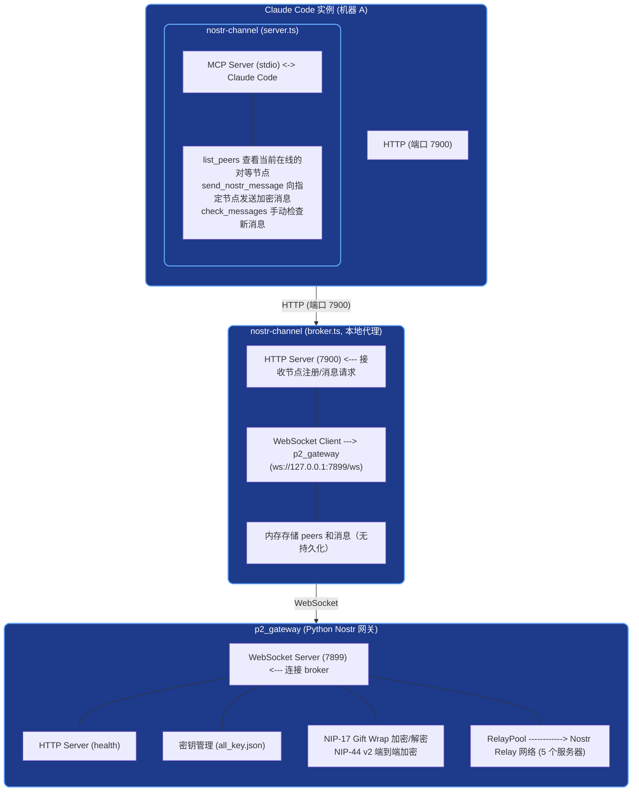

# P2P Claude Code 通讯项目

本项目实现了一个基于 [Nostr](https://nostr.com/) 协议的点对点消息系统，使不同机器上的 Claude Code 实例之间能够进行安全加密通讯。

## 整体架构



### 组件职责

| 组件 | 技术栈 | 职责 |
|------|--------|------|
| **nostr-channel/server.ts** | TypeScript (Bun) | MCP 服务器，提供 `list_peers`、`send_nostr_message`、`check_messages` 工具，供 Claude Code 调用 |
| **nostr-channel/broker.ts** | TypeScript (Bun) | 本地 HTTP 服务器，维护本机 peer 列表；WebSocket 客户端与网关通讯 |
| **p2_gateway/main.py** | Python | Nostr 网关：密钥管理、NIP-17/NIP-44 加密、连接 Nostr Relay 网络 |

## 目录结构

```
p2p_cc/
├── README.md                      # 本文档
├── nostr-channel/               # MCP Channel (TypeScript/Bun)
│   ├── package.json
│   ├── broker.ts                  # 本地 broker 守护进程
│   ├── server.ts                  # MCP 服务器
│   └── shared/
│       └── types.ts               # 共享类型定义
└── p2_gateway/                    # Nostr 网关 (Python)
    ├── main.py                    # 网关主程序
    └── requirements.txt           # Python 依赖
```

## 消息流

1. **同一机器**的 Claude Code 实例通过 `broker.ts` 的 HTTP 接口直接通讯，无需经过 Nostr 网络。
2. **跨机器**的消息通过以下路径：
   - `server.ts` → broker HTTP → `p2_gateway` WebSocket → Nostr Relay → 目标机器的网关 → broker → `server.ts`
3. 消息使用 **NIP-17 Gift Wrap** 协议进行加密封装，发送方使用临时密钥实现匿名性，内容使用 **NIP-44 v2** (ChaCha20-Poly1305 + HKDF) 端到端加密。

## 协议详解

### Broker HTTP API (nostr-channel → broker)

Broker 监听本地 HTTP 端口（默认 7900），所有请求为 JSON POST：

| 端点 | 用途 | 请求体 |
|------|------|--------|
| `POST /register` | 注册本机 peer | `{ "pid": 12345, "cwd": "/path", "npub": "npub1..." }` |
| `POST /heartbeat` | 保持连接活跃 | `{ "id": "peer_id" }` |
| `POST /list-peers` | 列出活跃 peers | `{}` |
| `POST /send-message` | 发送消息 | `{ "from_id": "...", "from_npub": "...", "to_npub": "...", "text": "..." }` |
| `POST /poll-messages` | 拉取未读消息 | `{ "id": "peer_id" }` |
| `POST /unregister` | 注销 peer | `{ "id": "peer_id" }` |
| `POST /get-key` | 获取密钥 | `{ "cwd": "/path" }` |
| `GET /health` | 健康检查 | - |

### Gateway WebSocket 协议 (broker ↔ p2_gateway)

Broker 通过 WebSocket (`ws://127.0.0.1:7899/ws`) 与网关通讯：

**Broker → Gateway:**

```json
{ "type": "request_key", "cwd": "/path/to/project" }
{ "type": "register", "npub": "npub1...", "cwd": "/path/to/project" }
{ "type": "send_dm", "to_npub": "npub2...", "content": "hello", "from_npub": "npub1..." }
```

**Gateway → Broker:**

```json
{ "type": "key_assigned", "cwd": "/path/to/project", "npub": "npub1...", "nsec": "nsec1..." }
{ "type": "dm_received", "from_npub": "npub2...", "to_npub": "npub1...", "content": "hello" }
```

### Nostr 事件格式 (Relay 层)

| Kind | 类型 | 说明 |
|------|------|------|
| 14 | Rumor | 未签名的 DM 内容 |
| 13 | Seal | 发送方签名 + NIP-44 加密的 rumor |
| 1059 | Gift Wrap | 临时密钥签名 + NIP-44 加密的 seal（发往 Relay） |
| 22242 | Auth | Relay 认证事件 |

### Nostr Relay 节点

网关连接以下 5 个公共 Nostr Relay：

- `wss://relay.damus.io`
- `wss://relay.0xchat.com`
- `wss://nostr.oxtr.dev`
- `wss://nostr-pub.wellorder.net`
- `wss://relay.primal.net`

## 安全模型

- **密钥存储**: 私钥保存在 `all_key.json`（网关侧）和 `key.json`（各实例侧）。请妥善保管这些文件。
- **端到端加密**: 使用 NIP-44 v2（ChaCha20-Poly1305 + HKDF）加密消息内容。
- **发送方匿名**: NIP-17 Gift Wrap 使用临时密钥，Relay 无法得知真实发送者。
- **无持久化**: broker 内存中的消息和 peer 列表在进程退出后丢失，重启后会重新注册。

## 环境变量

### nostr-channel

| 变量 | 默认值 | 说明 |
|------|--------|------|
| `NOSTR_BROKER_PORT` | `7900` | Broker HTTP 监听端口 |
| `GATEWAY_WS_URL` | `ws://127.0.0.1:7899/ws` | p2_gateway WebSocket 地址 |
| `DEBUG` | `0` | 设为 `1` 启用调试日志 |

### p2_gateway

| 变量 | 说明 |
|------|------|
| `HTTPS_PROXY` / `https_proxy` / `ALL_PROXY` / `all_proxy` | 代理设置（可选） |

## 安装与运行

### 前置条件

- [Bun](https://bun.sh/) >= 1.0
- Python >= 3.9
- pip

### 步骤 1: 启动 Nostr 网关

```bash
cd p2_gateway
pip install -r requirements.txt
python main.py
```

网关将在 `ws://0.0.0.0:7899/ws` 启动 WebSocket 服务，并连接 Nostr Relay 网络。首次运行会自动生成密钥并保存到 `all_key.json`。

### 步骤 2: 启动 nostr-channel Broker

```bash
cd nostr-channel
bun install
bun run broker.ts
```

Broker 将在 `http://localhost:7900` 启动，连接到网关的 WebSocket。

### 步骤 3: 在 Claude Code 中使用

配置 Claude Code 使用 nostr-channel 作为 MCP 通道。在 Claude Code 配置中添加：

```json
{
  "mcpServers": {
    "nostr-channel": {
      "command": "bun",
      "args": ["run", "/path/to/nostr-channel/server.ts"]
    }
  }
}
```

重启 Claude Code 后即可使用以下工具：

#### `list_peers`

列出当前在线的所有 Claude Code 实例（同一机器通过 broker，跨机器通过 Nostr Relay）。

#### `send_nostr_message`

向指定实例发送加密消息：

```
send_nostr_message(target_npub: "npub1...", message: "你好")
```

#### `check_messages`

手动检查是否有新消息到达。

### 快速启动（仅本地测试）

如果只需要同一机器上的多实例通讯：

```bash
# 终端 1: 启动 broker
cd nostr-channel && bun run broker.ts

# 终端 2-3: 各启动一个 MCP server
cd nostr-channel && bun run server.ts
```

两个 server 实例会自动注册到 broker，可以通过 `list_peers` 互相发现。

## 常见问题

**Q: 跨机器通讯失败？**
A: 确保两台机器都能访问 Nostr Relay 网络。检查 `p2_gateway` 是否正常运行，以及 `GATEWAY_WS_URL` 配置正确。

**Q: 如何查看分配给我的 npub？**
A: 在 Claude Code 中执行 `check_messages`，然后查看 `key.json` 或询问 `list_peers` 返回的 peer 信息。

**Q: 消息延迟高？**
A: Nostr Relay 的消息传播依赖 Relay 的性能。可以尝试更换不同的 Relay 节点。

**Q: 如何重置密钥？**
A: 删除 `p2_gateway/all_key.json` 和 `nostr-channel/key.json`，重启服务后会生成新的密钥对。
